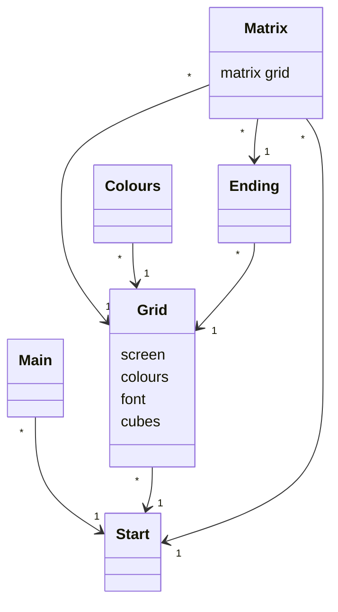
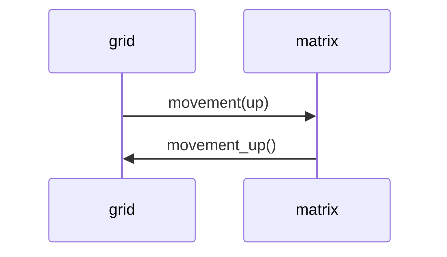

```mermaid
 classDiagram
      Matrix "*" --> "1" Grid
      Colours "*" --> "1" Grid
      Ending "*" --> "1" Grid
      Main "*" --> "1" Start
      Grid "*" --> "1" Start
      Matrix "*" --> "1" Start
      Matrix "*" --> "1" Ending
      class Grid{
          screen
          colours
          font
          cubes
      }
      class Matrix{
          matrix grid
      }
```

```mermaid
 sequenceDiagram
      participant grid
      participant matrix
      grid ->> matrix: movement(up)
      matrix ->> grid: movement_up()
      
```