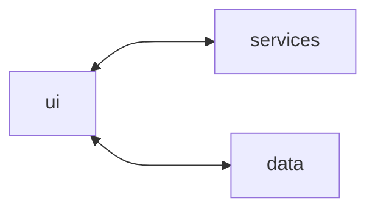
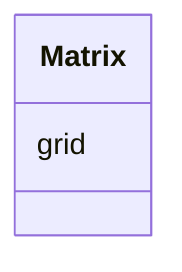
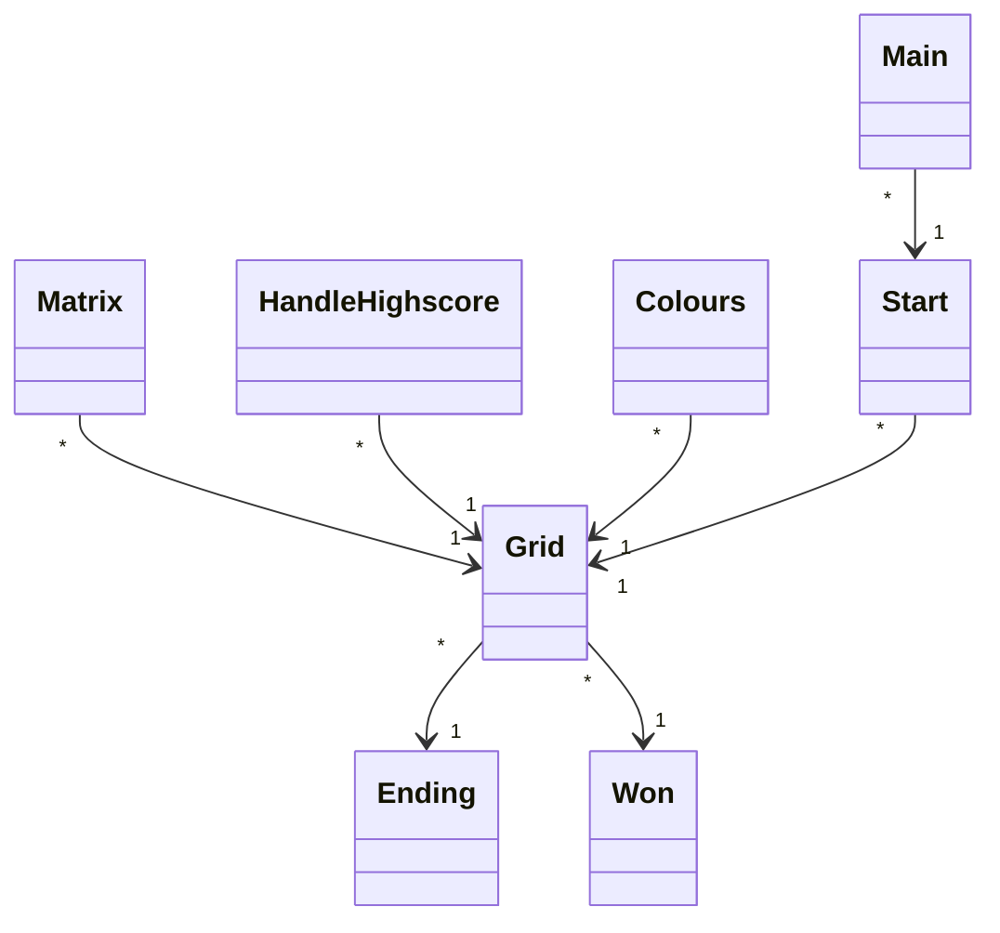
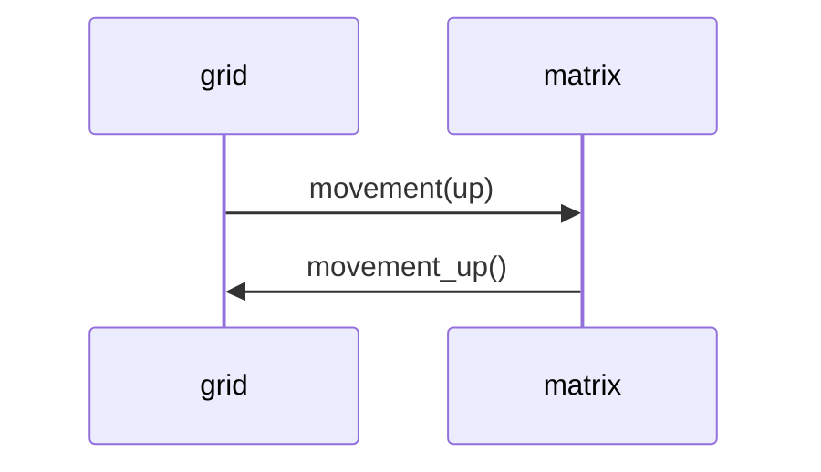
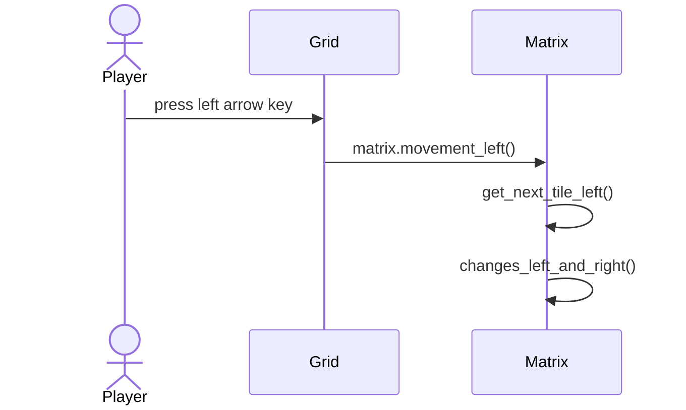
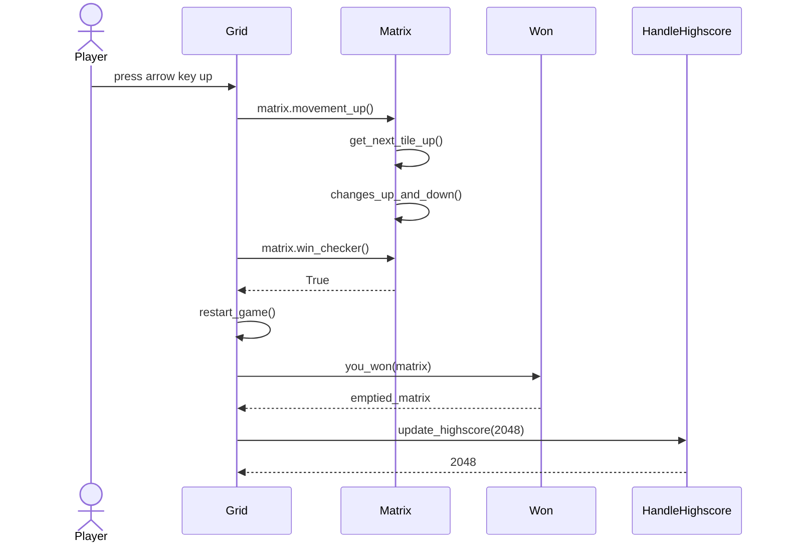
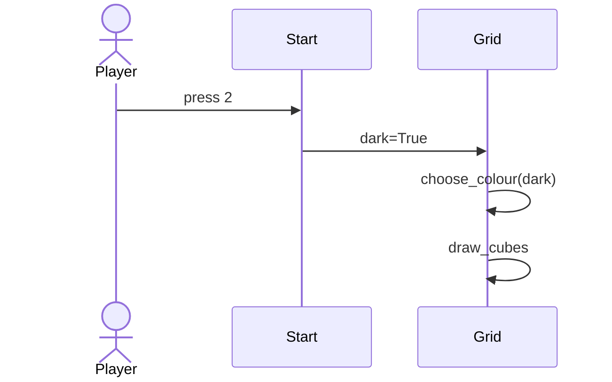

## Rakenne

Koodin simppeli pakkausrakenne on seuraavanlainen:

## Pakkausrakenne ja tiedostoista lyhyesti

Ui sisältää käyttöliittymän tiedostot grid.py, won.py, start.py ja ending.py. Jokainen kuvaa jotain käyttöliittymän näyttöä sovelluksessa. Grid piirtää pelinäkymän ja ruudukon matrix.py:n mukaisesti, ja kutsuu won.py ja ending.py:n luokkia. Start.py kutsuu grid.py:tä. Ui sisältää piirtämisen sekä sen miten käyttäjä voi käyttää sovellusta. 

Ui:n grid.py:hyn menee myös data-kansion highscore.py, joka sisältää highscoren tekstikansiossa. 

Services-kansion ainoa tiedosto on matrix.py, joka hoitaa yksinään sovelluslogiikan, jota grid.py mallintaa.

# Käyttöliittymä

UI sisältää neljä erilaista näkymää:

- Aloitusruutu
- Peliruutu
- Voittoruutu
- Häviämisruutu

Jokainen näistä on toteutettu omana luokkanaan ja ruuduista yksi on aina kerrallaan näkyvänä. Käyttöliittymä on pyritty eristämään sovelluslogiikasta. Se kutsuu services Matrix-luokan metodeja.

## Sovelluslogiikka

Luokka Matrix sisältää koko sovelluslogiikan. Siellä luodaan matriisi, joka kuvaa pelin ruudukkoa. Lisäksi siellä on määritelty miten liikkeet ja yhdistäminen toimivat, milloin ja miten luodaan uusia laattoja sekä milloin pelaaja on voittanut tai hävinnyt pelin.

Esimerkkejä luokan metodeista ovat esim: 

- `movement_up, movement_down, movement_left, movement_right`
- `starting_cubes` ja
- `new_cubes`

## Tiedon pysyväistallennus

Kansio data, sisältää highscore-tiedoston johon tallentuu suurin highscore. Kun viimeisin highscore ylittyy, tiedostoon päivitetään uusin highscore. 

## Luokkakaavio

Alla vielä luokkakaavio ohjelman luokista. (main on funktio omassa tiedostossaan). Colours on luokka, jossa luodaan värivaihtoehdot ja HandleHighscore-luokassa käsitellään datan highscore.py-tiedostoa.

## Päätoiminnallisuudet

Seuraavaksi esimerkkejä ohjelman päätoiminnallisuuksista sekvenssikaavioina:

### Liike

Sekvenssikaavio kuvaa kun pelaaja on pelinäkymässä ja painaa vasenta arrow-key-näppäintä. Eli Grid-luokan tapahtumien käsittelijä kutsuu Matrix-luokan liikemetodia joka kutsuu apumetodeita luokan sisällä. Matrix ei palauta mitään Grid-luokalle, sillä Grid saa matriisin parametrinä ja sen draw_cubes metodi piirtää sitä koko ajan. 

### Voittamistilanne

Sekvenssikaavio kuvaa kun pelaaja on pelinäkymässä ja saavuttaa luvun 2048 painamalla ylös-nappia. Eli liike tehdään matrix-luokassa, joka myös testaa onko voitettu. Jos kyllä, niin kutsutaan restart_game-metodia, joka puolestaan kutsuu Won-luokan metodia. Se nollaa tämän hetkisen ruudukon ja palauttaa tyhjän ruudukon. Sitten Grid kutsuu vielä HandleHighscoren metodia, joka päivittää uuden ennätyksen tiedostoon + palauttaa sen. 

### Värinvaihto

Sekvenssikaavio kuvaa värinvaihtotilannetta, kun pelaaja haluaa valita dark mode-laatat. Pelaajan valittua värin, se asettaa muuttujan dark todeksi. Tämä muuttuja on parametrina Grid-luokan metodille, joka asettaa draw_cubessa käytettäviksi väreiksi tummat värit.

### Muut toiminnallisuudet

Saman tyylinen periaate on sovelluksen kaikissa toiminnallisuuksissa, käyttöliittymän tapahtumakäsittelijä kutsuu sopivaa sovelluslogiikan metodia, sovelluslogiikka päivittää matriisia ja käyttöliittymä piirtää. Esimerkiksi häviämisikkunan logiikka muistuttaa paljon voittamisikkunan toiminnallisuuden logiikkaa.

## Ohjelman rakenteeseen jääneet heikkoudet

### Repository-suunnittelumalli

Ohjelmassa ei ole käytetty Repository-suunnittelumallia. Jatkossa tämä olisi hyvä ottaa käyttöön, jotta tiedon tallentaminen voisi olla laajempaan ja käytännönläheisempää. Jos joku asia muuttuisi jossain tiedostossa, suunnittelumallin ansiosta asioita pystyisi muuttaa paikallisemmin. 